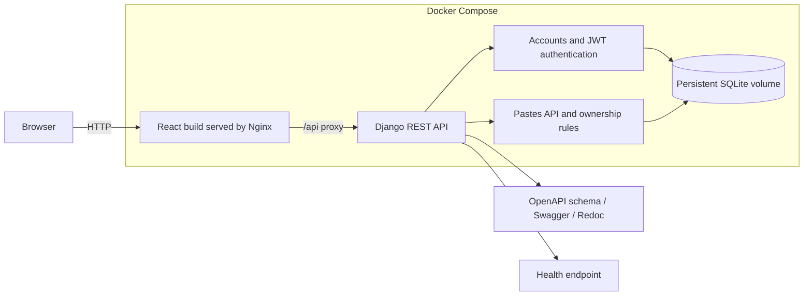

# PasteBin

A full-stack PasteBin application for creating, sharing, and managing text or code snippets. The project pairs a React/Vite client with a Django REST API, JWT authentication, per-paste visibility controls, and owner-only write access.

## Features

- Create pastes with a title, content, language, and visibility level.
- Browse public pastes and view a three-line content preview from the list.
- Retrieve individual pastes by UUID.
- Register and sign in with email and password.
- Manage `my_pastes` for the currently signed-in user.
- Edit and delete only pastes owned by the signed-in user.
- Use public, unlisted, and private paste visibility levels.
- Explore the API through generated Swagger and Redoc documentation.
- Check API and database availability through a health endpoint.

## Architecture



### Request flow

1. The React client sends requests to `http://127.0.0.1:8000/api` using Axios.
2. After login, the client stores the JWT access token locally and attaches it as a `Bearer` token on later requests.
3. Django REST Framework authenticates the request, applies visibility and ownership rules, and reads or writes SQLite data.
4. Django returns JSON responses to the client.

## Tech stack

| Area | Technology |
| --- | --- |
| Frontend | React 19, Vite, React Router, Axios |
| Backend | Django 6, Django REST Framework |
| Authentication | Simple JWT (access and refresh tokens) |
| API documentation | drf-spectacular, Swagger UI, Redoc |
| Database | SQLite |
| Configuration | python-decouple and `.env` |

## Project structure

```text
.
|-- apps/
|   |-- accounts/              # Custom email-based user model and auth endpoints
|   `-- pastes/                # Paste model, serializers, permissions, and API views
|-- pastebin_project/          # Django settings and root URL configuration
|-- frontend/
|   `-- src/                   # React pages, context, components, and API client
|-- manage.py
|-- requirements.txt
`-- README.md
```

## Prerequisites

- Python 3.12 or later
- Node.js 20 or later
- npm

## Local setup

### 1. Configure and start the backend

Create and activate a virtual environment:

```bash
python -m venv venv
```

macOS/Linux/WSL:

```bash
source venv/bin/activate
```

Windows PowerShell:

```powershell
.\venv\Scripts\Activate.ps1
```

Install dependencies:

```bash
pip install -r requirements.txt
```

Create a `.env` file in the repository root:

```env
SECRET_KEY=replace-with-a-long-random-value
DEBUG=True
ALLOWED_HOSTS=127.0.0.1,localhost
DB_NAME=db.sqlite3
```

Apply database migrations and start Django:

```bash
python manage.py migrate
python manage.py runserver
```

The API is available at `http://127.0.0.1:8000`.

### 2. Configure and start the frontend

In a second terminal:

```bash
cd frontend
npm install
npm run dev
```

Open the URL printed by Vite, normally `http://localhost:5173`.

> The frontend API base URL is currently `http://127.0.0.1:8000/api`, configured in `frontend/src/api/axios.js`.

## Run with Docker

Docker Compose runs the frontend, backend, Nginx reverse proxy, and a persistent SQLite volume.

1. Create the root `.env` file as shown in [Local setup](#local-setup).
2. Build and start the services:

```bash
docker compose up --build
```

3. Open the application at `http://localhost:5173`.

The backend is also available directly at `http://localhost:8000`. Paste data persists in the named `pastebin_data` Docker volume.

To stop the services:

```bash
docker compose down
```

To stop the services and remove the stored database volume:

```bash
docker compose down --volumes
```

> `docker compose down --volumes` permanently removes the containerized SQLite data.
## Authentication and authorization

Users authenticate with an email address and password. Successful login returns JWT access and refresh tokens.

- Public pastes can be listed and viewed by anyone.
- Unlisted pastes are not included in the public list but can be viewed with their direct UUID URL.
- Private pastes can only be viewed by their owner.
- Only the owner of a paste can update or delete it. This is enforced by the backend permission class, not only by the frontend UI.
- Anonymous users may create pastes; those pastes have no owner.

## API reference

| Method | Endpoint | Purpose |
| --- | --- | --- |
| `POST` | `/api/auth/register/` | Create an account |
| `POST` | `/api/auth/login/` | Obtain JWT access and refresh tokens |
| `POST` | `/api/auth/refresh/` | Refresh an access token |
| `GET` | `/api/auth/me/` | Get the signed-in user |
| `GET` | `/api/pastes/` | List public pastes and the caller's own pastes |
| `POST` | `/api/pastes/` | Create a paste |
| `GET` | `/api/pastes/{id}/` | Retrieve a paste |
| `PUT` / `PATCH` | `/api/pastes/{id}/` | Update an owned paste |
| `DELETE` | `/api/pastes/{id}/` | Delete an owned paste |
| `GET` | `/api/health/` | Check API and database health |
| `GET` | `/api/schema/` | Get the OpenAPI schema |
| `GET` | `/api/docs/` | Open Swagger UI |
| `GET` | `/api/redoc/` | Open Redoc |

### Example: create a paste

```bash
curl -X POST http://127.0.0.1:8000/api/pastes/ \
  -H "Content-Type: application/json" \
  -H "Authorization: Bearer <access-token>" \
  -d '{
    "title": "Hello world",
    "content": "print(\"Hello, world!\")",
    "language": "python",
    "visibility": "public"
  }'
```

## API response notes

Paste list results use Django REST Framework pagination:

```json
{
  "count": 1,
  "next": null,
  "previous": null,
  "results": [
    {
      "id": "uuid",
      "owner": "user@example.com",
      "title": "Hello world",
      "content": "print(\"Hello, world!\")",
      "language": "python",
      "visibility": "public"
    }
  ]
}
```

## Health check

Call:

```bash
curl http://127.0.0.1:8000/api/health/
```

Expected response:

```json
{"status":"ok","database":"ok"}
```

## Current operational status

The project can run locally or through Docker Compose. CI/CD, production deployment, and automated test coverage have not yet been added.

## License

No license has been specified for this project.